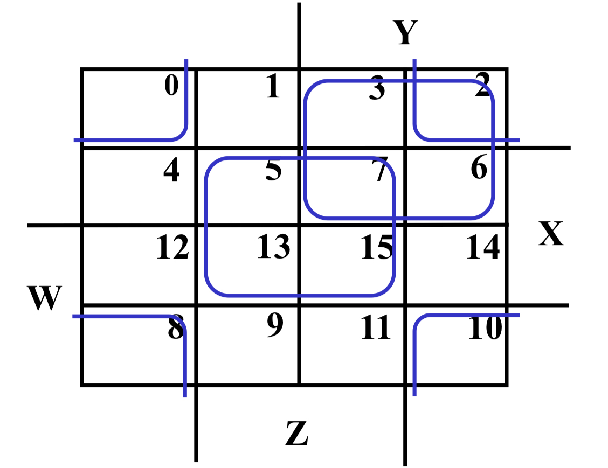

<link rel="stylesheet" href="custom.css">

# LCDF

 

## Week 2: Canonical Forms and Circuit Optimization

<!--s-->

# Part 1

# Canonical Forms

<!--v-->

### Difficulties in Manipulating Boolean Functions

 

- **For Boolean function have function proof**

  - **Problem**: a Boolean function has multiple expressions.

- **For expression simplification**

  - **Problem 1**: too many identities and theorems of Boolean algebra to apply

  - **Problem 2**: requires skills for simplification (e.g., $BC=(A+\overline{A})\cdot{BC}$)

- **Solutions**
    $\bar{B}\bar{D}+CD+AD+A\overline{B}+\overline{B}C \xrightarrow{\substack{Algebraic \\ Transformation}} \Sigma_m(0,2,3,7,8,9,10,11,13,15)$
    
    $ \xrightarrow{\substack{Minimization \\ Theorem}} \bar{B}\bar{D}+(A+C)D$

<!--v-->

### Canonical Forms for Comparison of Equality

<!--v-->

### Boolean Expressions for a Truth Table

<!--v-->

### Minterms

 

- **Minterms** are **AND terms with every variable** present in either **true** (e.g., $x$) or **complemented form** (e.g., $\overline{x}$)

- For n-input variables, there are $2^n$ minterms or $2^n$ total number of possible input combinations.
- Each minterm **equals 1 at exactly one particular input combination** and **is equal to 0 at all other combinations**.

- In general, minterms are designated $m_i$, where $i$ corresponds the **input binary combination at which this midterm is equal to 1.**

<!--v-->

### Maxterms

 

- **Maxterms** are **OR terms with every variable** present in either **true** (e.g., $x$) or **complemented form** (e.g., $\overline{x}$)

- For n-input variables, there are $2^n$ minterms or $2^n$ total number of possible input combinations.
- Each maxterm **equals 0 at exactly one particular input combination** and **is equal to 1 at all other combinations**.

- In general, minterms are designated $m_i$, where $i$ corresponds the **input binary combination at which this midterm is equal to 1.**

<!--v-->

### Two Principles of Minterms and Maxterms

 

-  All variables will be present in a minterm or maxterm and will be listed in the **same order** (usually **alphabetically**)

- Whether minterm or maxterm must **contain all variables**.

<!--v-->

### Practice1: Write down Canonical Forms for

### $F(A,B,C)=\bar{x}\bar{y}z+x\bar{y}\bar{z}+xyz$

<!--v-->

### Practice2: Find $F(A,B,C,D,E)=m_{2}+m_{9}+m_{17}+m_{23}$

<!--v-->

### Q: How to implement $F(A,B,C)=A+\overline{B}C$ as a sum of minterms and a product of maxterms?

<!--v-->

### Transformation to Canonical Sum of Minterms

 

- Any Boolean Function can be expressed as a Sum of Minterms (SOM).
  - For the function table, the minterms used are the forms corresponding to the 1's
  - For expressions, **expand all terms** first to explicitly list all minterms. Do this by **"ANDing"** any term missing a variable v with a term $(v+\overline{v})$

- Example: Implement $f=x+\bar{x}\bar{y}$ as a sum of minterms.
  - First expand terms: $f=x(y+\overline{y})+\bar{x}\bar{y}$
  - Then distribute terms: $f=xy+x\overline{y}+\bar{x}\bar{y}$
  - Express as sum of minterms: $f=m_0+m_2+m_3$

<!--v-->

### Transformation to Canonical Product of Maxterms

- Any Boolean Function can be expressed as a Product of Maxterms (POM).

  - For the function table, the maxterms used are the terms corresponding to the 0's
  - For an expression, **expand all terms** first to explicitly list all maxterms. Do this by first applying the second **distributive law**, **"ORing"** terms missing variable v with a term equal to $v\cdot\overline{v}$ and then applying the **distributive law** again.

- Example: Convert to product of maxterms: $f(x,y,z)=x+\bar{x}\bar{y}$

  - Apply the distributive law:

    $x+\bar{x}\bar{y}=(x+\bar{x})(x+\bar{y})=1\cdot(x+\bar{y})=x+\bar{y}$

  - Add missing variable z:

    $x+\overline{y}+z\cdot{\overline{z}}=(x+\overline{y}+z)(x+\overline{y}+\overline{z})$

  - Express as sum of minterms: $f=M_2\cdot{M_3}$

<!--v-->

### Conversion Between Forms

- To convert between sum-of-minterms and product-of-maxterms form (or vice-versa) we follow these steps:
  - Find the function **complement** by swapping terms in the list with terms not in the list
  - **Change from product to sums**, or vice versa.

- Example: Given F as before: $F(x,y,z)=\Sigma_m(1,3,5,7)$
- Form the Complement: $\overline{F}(x,y,z)=\Sigma_m(0,2,4,6)$
- Then use the other form with the same indices - this forms the complement again, giving the other form of the origin function: $F(x,y,z)=\Pi_M(0,2,4,6)$

<!--v-->

### Minterms to Maxterms Conversion

- Example: Implement F1 as POM:

  $\overline{F_1}=m_0+m_2+m_3+m_5+m_6$

  $F_1=\overline{m_0}\cdot\overline{m_2}\cdot\overline{m_3}\cdot\overline{m_5}\cdot\overline{m_6}=M_0\cdot{M_2}\cdot{M_3}\cdot{M_5}\cdot{M_6}$

<!--s-->

# Part 2

# Circuit Optimization

<!--v-->

### Circuit Optimization

 

- Goal: To obtain the simplest implementation for a given function
- Optimization is a more formal approach to simplification that is preformed using a specific procedure or algorithm
- **Optimization requires a cost criterion to measure the simplicity of a circuit**
- Distinct cost criteria we will use:
  - Literal cost (L)
  - Gate input cost (G)
  - Gate input cost with NOTs (GN)

<!--v-->

### Input Cost

 

<!--v-->

### Karnaugh Maps (K-map)

 

- A K-map is a collection of squares
  - Each square represents a **minterm or maxterm**
  - The Boolean results are transferred from a truth table onto a **two-dimensional grid**
  - Adjacent squares differ in the value of one variable (each square is ordered in **Gray Code**)
  - Alternative algebraic expressions for the same function are derived by **recognizing patterns of squares**
- The K-map can be viewed as
  - A reorganized version of the **truth table**
  - A clever way to **rewrite truth tables** to make it easier to figure out the logic
  - A topologically-warped Venn diagram as used to visualize sets in algebra of sets

<!--v-->

### Steps to Minimize Expressions using K-map

 

- Step 1: **Identify minterms or maxterms**
- Step 2: **Fill the K-map with minterms or maxterms**
  - For SOM, put 1's in squares respective to the minterms
  - For POM, put 0's in squares respective to the maxterms
- Step 3: **Form the rectangular groups** containing maximum number of terms in power of two
- Step 4: **Obtain the simplified expression** for groups
  - For SOM, find the product terms and sum them up
  - For POM, find the sum terms and take product of them

<!--v-->

### Four Variable Maps

<!--v-->

### Example 1: Four Variable Map Simplification

#### $F(W,X,Y,Z)=\Sigma_{m}(0,2,4,5,6,7,8,10,13,15)$

<!--v-->

### Example 2: Four Variable Map Simplification

#### $F(W,X,Y,Z)=\Sigma_m(3,4,5,7,9,13,14,15)$

<!--v-->

### Don't Cares in K-Maps

- Sometimes a function table or map contains entries for which it is known:
  - The input values for the **minterm will never occur**, or
  - The output value for **minterm is not used**

- In these cases, the output value need not be defined.
- The output value is defined as a "don't care" that may on either a 0 or 1 value in resulting solutions
- By placing "don't cares" (an "x" entry) in the function or map, the cost of the logic circuit may be lowered.
- Example: A logic function having the binary codes for the BCD digits as its inputs. Only the codes for 0 through 9 are used. The six codes, **1010 through 1111 will never occur**, so the output values for these codes are "don't cares".

<!--v-->

### Product of Sums Example

<!--v-->

### Systematic Simplification

- **Implicant** is a minterm/product term in SOP or maxterm/sumterm in POS of a Boolean function. For example:

  $F=AB+ABC+BC$. Implicants are AB, ABC and BC.

- The group of "1's" is called **implicant**. There are two types of implicants: **Prime Implicant** and **Essential Prime Implicant**.

- A **Prime Implicant** is a product term obtained by combining the **maximum possible number** of adjacent squares in the map into a rectangle with the number of squares a power of 2.
- An **Essential Prime Implicant** is a prime implicant that covers **one or more minterms** that no combination of other prime implicants are able to include.

<!--v-->

### Practice1: Find all prime implicants for:

### $F(A,B,C,D)=\Sigma_m(0,2,3,8,9,10,11,12,13,14,15)$

<!--v-->

### Practice2: Find all prime implicants for:

### $G(A,B,C,D)=\Sigma_m(0,2,3,4,7,12,13,14,15)$

<!--v-->

### Quine-McCluskey Algorithm

 

- Find **all prime implicants**
- Include **all essential prime implicants** in the solution
- Select **a minimum cost set of non-essential prime implicants** to cover all minterms not yet covered:
  - Obtaining a good simplified solution: Use the Selection Rule

<!--v-->

### Prime Implicant Selection Rule

 

- **Minimize the overlap among prime implicants as much as possible.** 
- In particular, in the final solution, make sure that each prime implicant selected **includes at least one midterm not included in any other prime implicant selected**.

<!--v-->

### Simplify Boolean Expression $F$ through K-map Given by:

### $F(A,B,C,D)=\Sigma_m(3,4,6,9,11)+\Sigma_d(2,5,7,10,13)$ 
