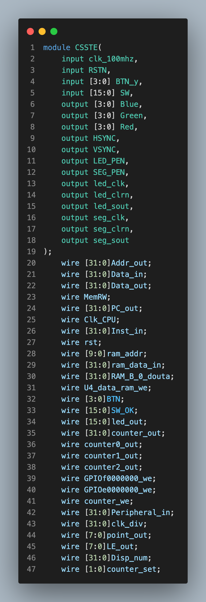
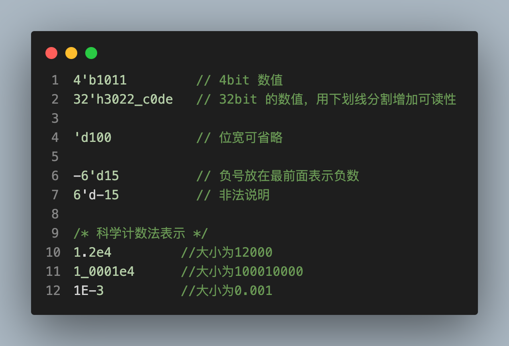
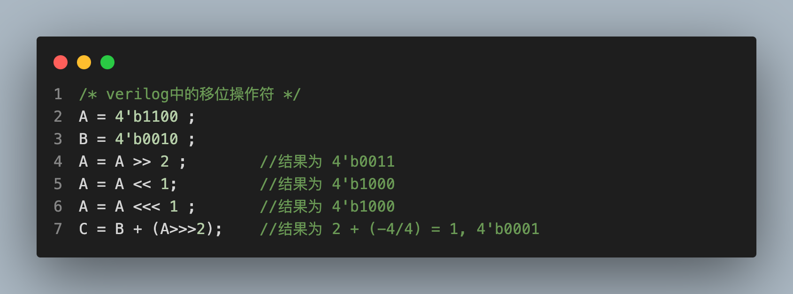

<link rel="stylesheet" href="custom.css">

# LCDF

 

## Week 3: Verilog

<!--s-->

## Part 1

## 为什么要使用Verilog?

<!--v-->

### 设计硬件的两种方法

 

#### 方法一：原理图设计

<!--v-->

### 设计硬件的两种方法 (cont.)

 

#### 方法二：硬件描述语言设计

    

<!--s-->

## Part 2

## Verilog语法

<!--v-->

### Verilog基本书写格式

<!--v-->

### Verilog中的数值表示

<!--v-->

### Verilog中的数据类型

 

##### **线网(wire)**: **wire** 类型表示硬件单元之间的物理连线，它不存储任何值，只是表示信号之间的连线。**wire** 的值由其连接的元件（如门或模块输出）驱动。不能在过程块中为 **wire** 赋值，但可以通过连续赋值 (**assign** 语句) 或其它模块的输出来为其赋值。

<!--v-->

### Verilog中的数据类型 (cont.)

 

##### **寄存器(reg)**: **reg** 类型用来表示存储单元，它会保持数据原有的值，直到被改写。在 Verilog 中，**reg** 类型的变量可以在过程块（如 **always** 或 **initial** 块）中被赋值。它会保存其值，直到下一次被赋新值。

<!--v-->

### **reg** vs. **wire**

 

- **默认值**:
  - **reg**：默认情况下，没有明确初始化的 **reg** 类型的变量是“X”（未知）状态。
  - **wire**：除非有其他驱动，否则默认为“z”（高阻抗）状态。
- **赋值方式**:
  - **reg**：可以使用非阻塞赋值 (**<=**) 或阻塞赋值 (**=**) 在过程块内部赋值。
  - **wire**：只能通过连续赋值 (**assign**) 或其他模块的输出赋值。
- **扩展功能**:
  - **reg** 可以是标量、矢量、多维数组或是一个复杂的数据结构（例如队列、动态数组等）。
  - **wire** 可以是标量或矢量，但不能是多维数组或复杂数据结构。

<!--v-->

### Verilog中的数据类型 (cont.)

 

##### **向量(vector)**: 当位宽大于 1 时，**wire** 或 **reg** 即可声明为向量的形式。例如：

<!--v-->

<!--v-->

<!--v-->

<!--v-->

### Verilog中的数据类型 (cont.)

 

##### **整数（integer)**: 整数类型用关键字 **integer** 来声明。声明时不用指明位宽，位宽和编译器有关，一般为32 bit。reg 型变量为无符号数，而 integer 型变量为有符号数。例如：

### Verilog中的数据类型 (cont.)

 

##### **参数(parameter)**: 参数用来表示常量，用关键字 **parameter** 声明，只能赋值一次。例如：

<!--v-->

### Verilog中的表达式

##### 算术运算符

<!--v-->

##### 关系运算符

<!--v-->

##### 按位运算符

<!--v-->

##### 移位运算符

