---

title: Number Systems and Boolean Algebra
separator: <!--s-->
verticalSeparator: <!--v-->
theme: serif
highlightTheme: tomorrow-night-bright
revealOptions:
  width: 1600
  height: 900
  margin: 0.04
  transition: 'fade'
  slideNumber: true

---

<link rel="stylesheet" href="custom.css">

# LCDF

 

## Week 4: Verilog

<!--s-->

## Part 1

## Verilog语法

<!--v-->

### Verilog中的常用语句

 

##### **连续赋值语句(assign):** 在 Verilog 中，连续赋值语句是一种用于描述硬件电路中信号间连续传递关系的重要语句。这种赋值语句通常用于组合逻辑设计，它能够实现信号的即时更新。

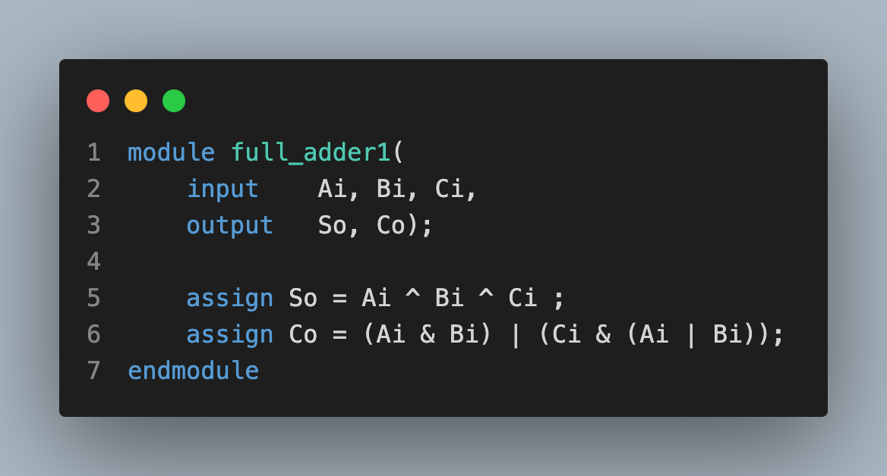

<!--v-->

### Verilog中的常见语句(cont.)

 

##### 时延：连续赋值延时语句中的延时，用于控制任意操作数发生变化到语句左端赋予新值之间的时间延时。通常用#加上正整数来表示

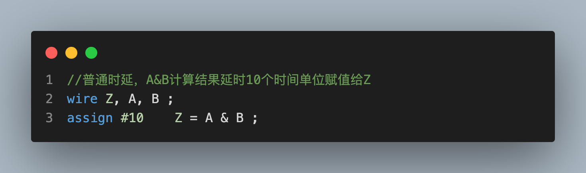

<!--v-->

### Verilog中的常见语句(cont.)

 

##### **Initial语句**：initial 语句从 0 时刻开始执行，只执行一次，多个 initial 块之间是相互独立并行的。如果 initial 块内包含多个语句，需要使用关键字 begin 和 end 组成一个块语句。

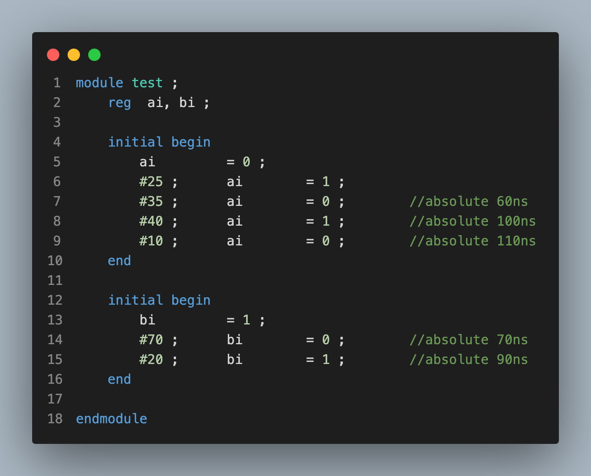

<!--v-->

### Verilog中的常见语句(cont.)

##### **Always语句**：与 initial 语句相反，always 语句是重复执行的。always 语句块从 0 时刻开始执行其中的行为语句；当执行完最后一条语句后，便再次执行语句块中的第一条语句，如此循环反复。

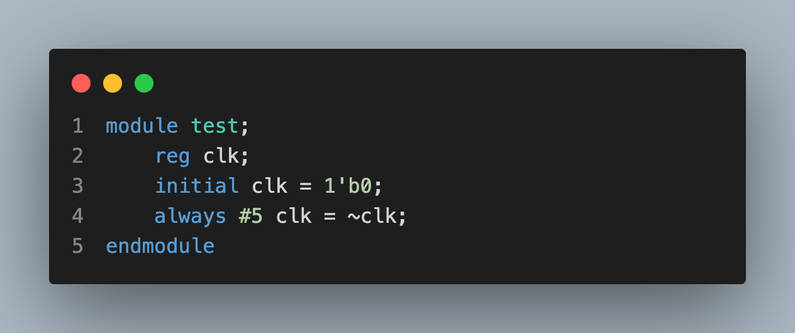

<!--v-->

### 带条件的always语句块

 

##### always后跟@(触发条件)，即可使得always在触发条件发生变化时，执行块中的内容

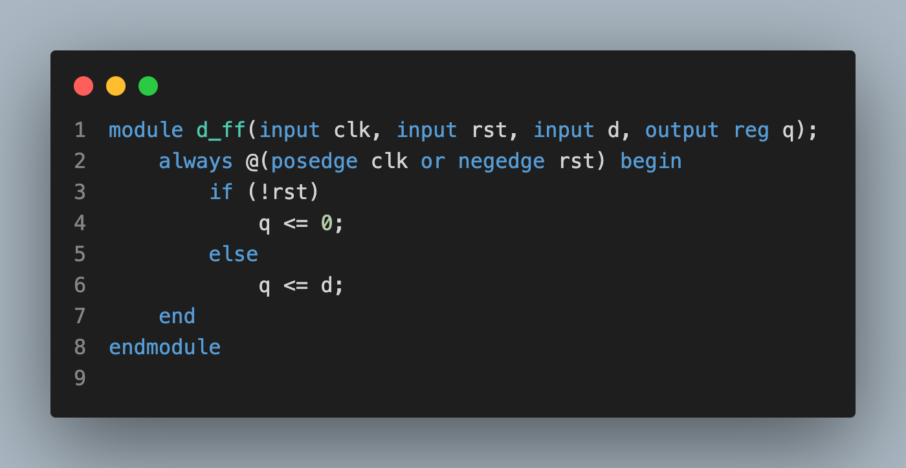

<!--v-->

### Verilog中的常见语句(cont.)

 

##### **条件语句**：条件（if）语句用于控制执行语句要根据条件判断来确定是否执行。条件语句用关键字 if 和 else 来声明，条件表达式必须在圆括号中。

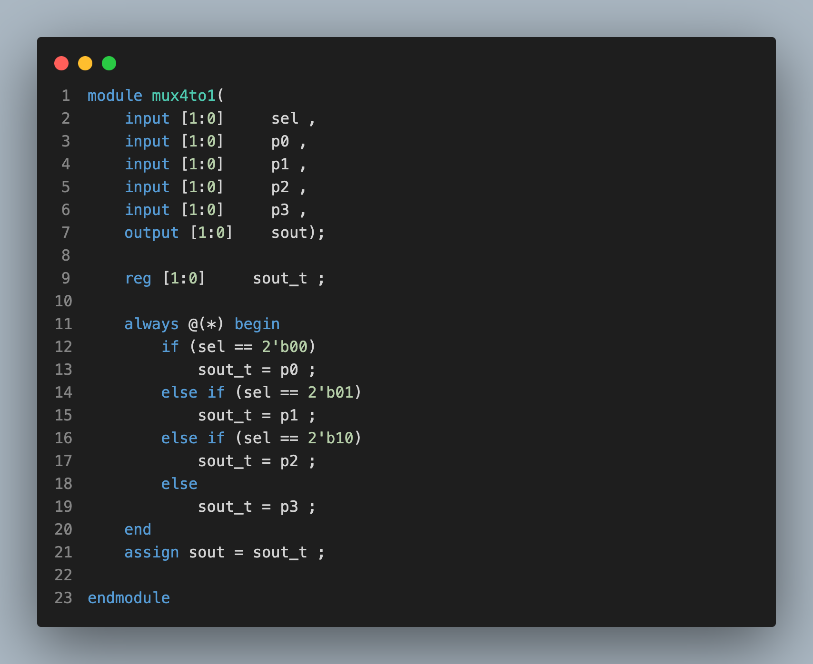

<!--v-->

### Verilog中的常见语句(cont.)

##### 多路分支语句(case)：case 语句是一种多路条件分支的形式，可以解决 if 语句中有多个条件选项时使用不方便的问题。

<!--v-->

### Verilog中的常见语句(cont.)

##### **循环语句**：Verilog 循环语句有 4 种类型，分别是 while，for，repeat，和 forever 循环。循环语句只能在 always 或 initial 块中使用，但可以包含延迟表达式。

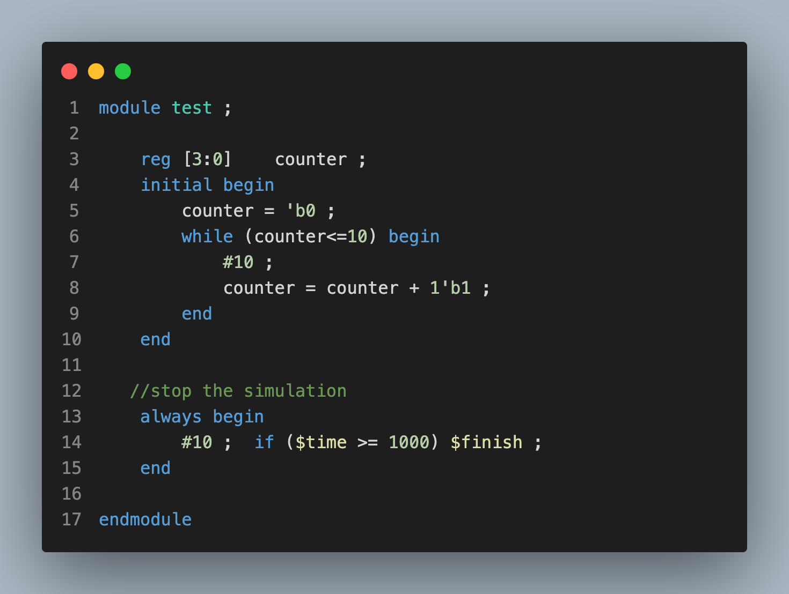

<!--v-->

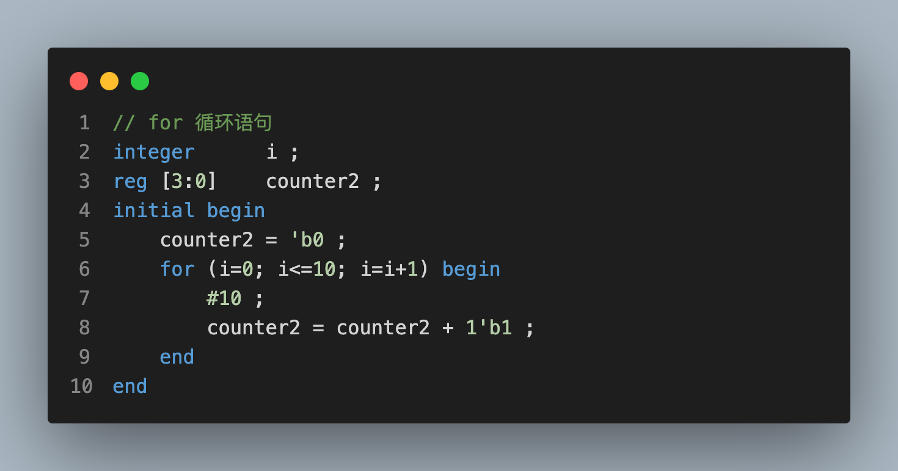

<!--v-->

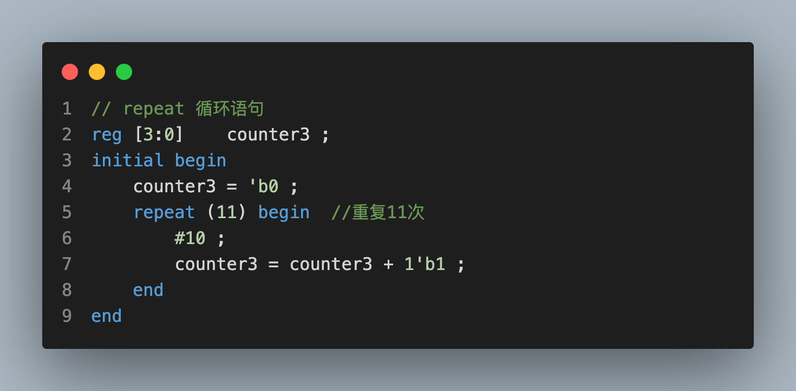

<!--v-->

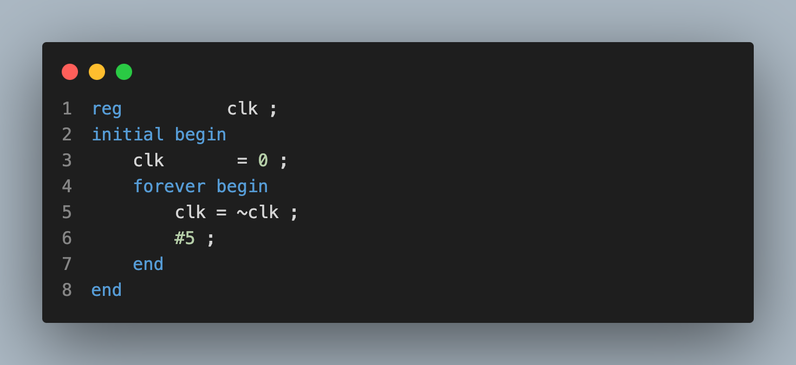

<!--s-->

## Part 2

## Verilog顶层设计

<!--v-->

### Verilog模块与端口

 

##### Verilog模块例化：在一个模块中引用另一个模块，对其端口进行相关连接，叫做模块例化。模块例化建立了描述的层次。信号端口可以通过位置或名称关联，端口连接也必须遵循一些规则。

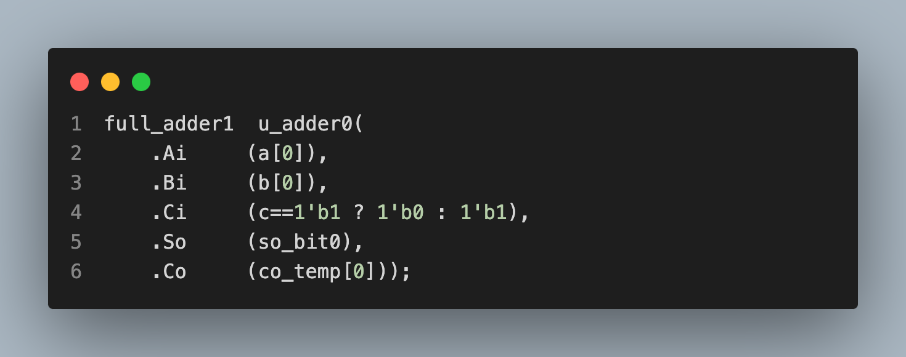

<!--v-->

### Verilog模块与端口

 

##### 如果某些输出端口并不需要在外部连接，例化时可以悬空不连接，甚至删除。一般来说，input 端口在例化时不能删除，否则编译报错，output 端口在例化时可以删除。

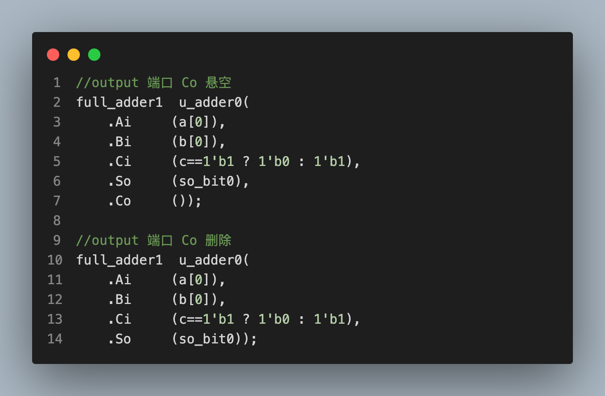

<!--v-->

### Verilog模块与端口

 

##### 具体例子：设计一个八种操作的ALU

    
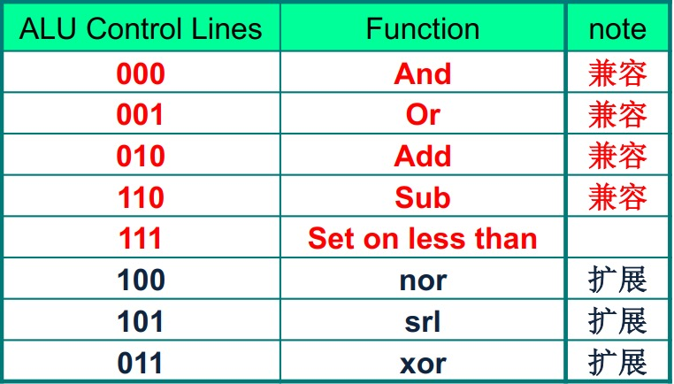
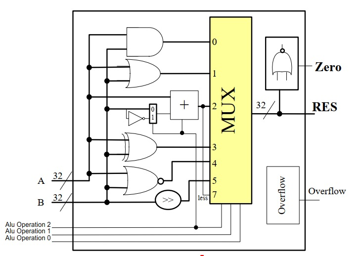

<!--v-->

    

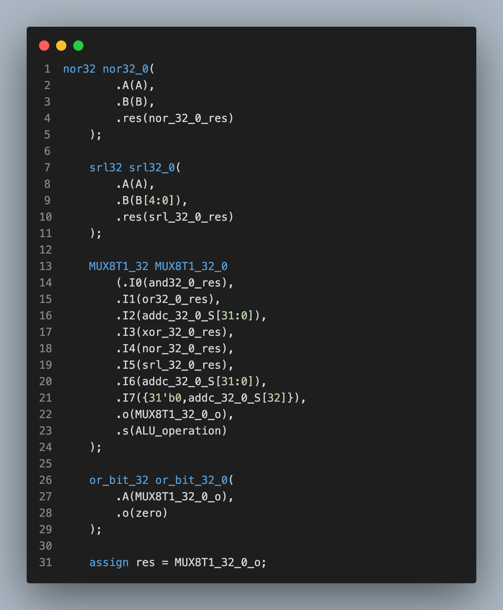

