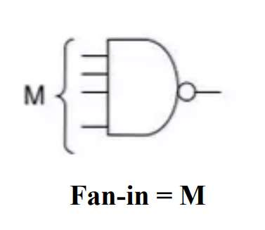
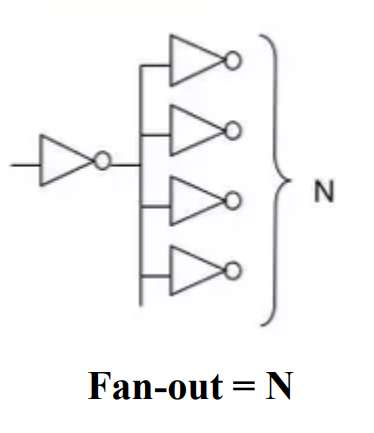
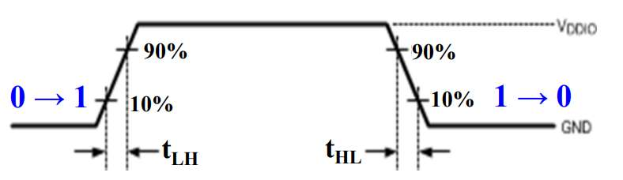
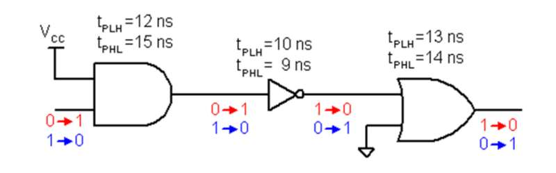
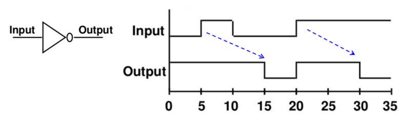
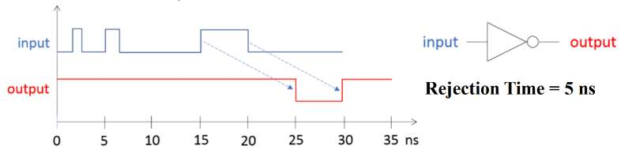
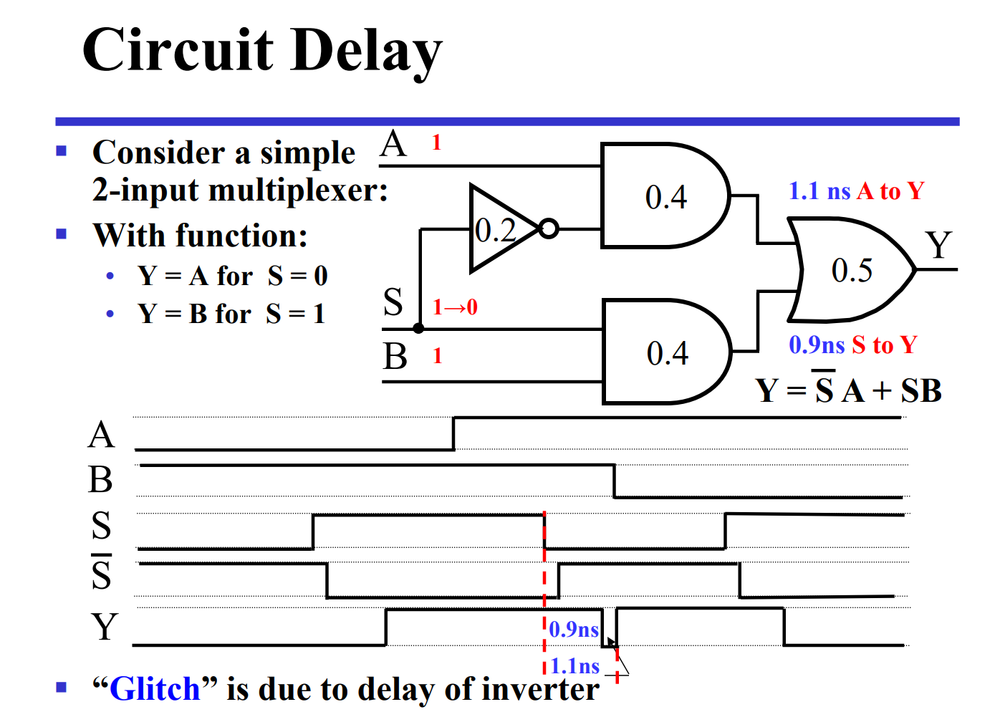
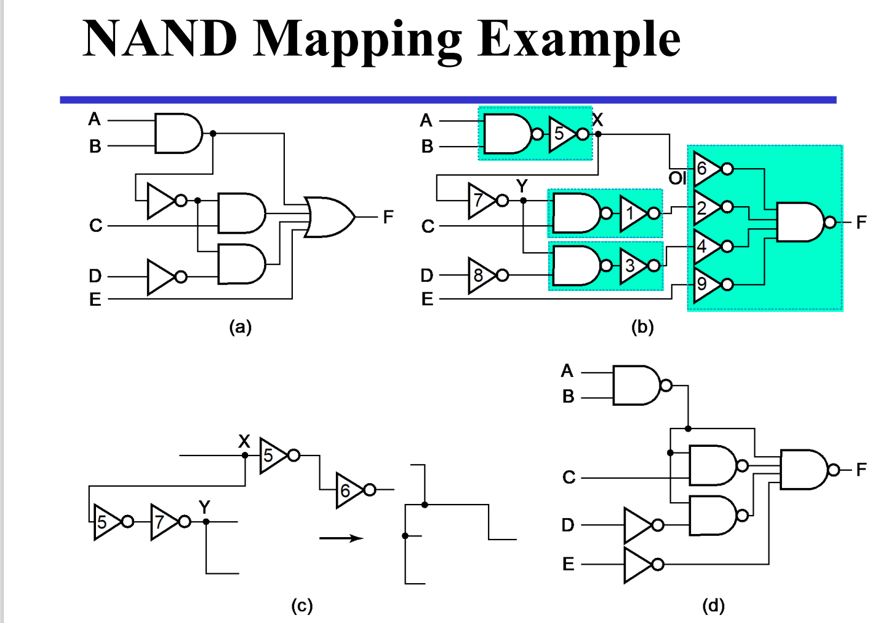

<link rel="stylesheet" href="custom.css">

# LCDF

 

## Week 5: Combinational Logic Design

<!--s-->

## Part 1

## Logic Design

<!--v-->

### Design Procedure

 

- **Specification**: Write a specification for the circuit, if one is not already available.
- **Formulation**: Derive the truth table or initial Boolean equations that define the required relationships between inputs and outputs.
- **Optimization**: Apply two-level and multiple-level optimization. Draw a logic diagram or provide a netlist for the resulting circuit using ANDs, ORs, and inverters.
- **Technology Mapping**: Transform the logic diagram or netlist to a new diagram or netlist using the available implementation technology
- **Verification**: Verify the correctness of the final design.

<!--v-->

### Technology Parameters

 

- Specific gate implementation technologies are characterized by the following parameters:
  - ***Fan-in*** - the number of inputs available on a gate
  - ***Fan-out*** - the number of standard loads driven by a gate output
  - *Logic Levels* - the signal value ranges for 1 and 0 on the inputs and 1 and 0 on the outputs
  - *Noise Margin* - the maximum external noise voltage superimposed on a normal input value that will not cause an undesirable change in the circuit output
  - *Cost for a gate* - a measure of the contribution by the gate to the cost of the integrated circuit
  - ***Propagation Delay*** - The time required for a change in the value of a signal to propagate from an input to an output
  - *Power Dissipation* - the amount of power drawn from the power supply and consumed by the gate

<!--v-->

### Fan-in and Fan-out

 

     
  <ul style="list-style-type: disc; padding-left: 20px;">         
    <li>             
      
                 
             
					<b>Fan-in</b>: The fan-in is defined as the maximum number of inputs that a logic gate can accept. If number of input exceeds, the output will be undefined or incorrect.
      
         
    </li>         
    <li>             
      
                 
          
        	<b>Fan-out</b>: The fan-out is defined as the maximum number of inputs (load) that can be connectd to the output of a gate without degrading the normal operation.
      
         
    </li>     
  </ul> 

<!--v-->

### Fan-out

 

- **Transition time**
  - $t_{LH}$(rise time): output switches from 10% to 90% of the maximum value.
  - $t_{HL}$(fall time): output switches from 90% to 10% of the maximum value.

- The **maximum fan-out** is the number of standard loads the gate can drive **without exceeding its specified maximum transition time**.

<!--v-->

### Propagation Delay

 

- **Propagation delay** is the time for a change on an input of a gate to propagate to the output.
- High-to-low ($t_{PHL}$) and low-to-high ($t_{PLH}$) output signal changes may have different propagation delays.
- High-to-low and low-to-high transitions are defined with respect to the output, not the input

<!--v-->

### Delay Model

 

- **Transport delay**
  - A change in the output in response to a change on the inputs occurs after **a fixed specified delay**.
  - Circuits are like ideal conductors; that is, they are modeled as having no resistance.

<!--v-->

### Delay Model

 

- **Inertial delay (rejection time)** is a measure of the elapsed time during which a signal must **persist at an input of a device in order for a change** to appear at an output.

- A pulse of duration less than the inertial delay does not contain enough energy to cause the device to switch

  

<!--v-->

<!--v-->

### Technology Mapping

 

- Technology mapping is an important step in the process of logic synthesis, which transforms a **technology-independent logic description** into a **particular technology specification**.

- One of the key operations during technology mapping is to recognize logic equivalence between a portion of the initial logic description and an element of the target technology.

- Mapping to NAND gates is accomplished by:
  - **Replacing** AND and OR symbols
  - **Pushing** inverters through circuit **fan-out points**
  - **Canceling** inverter pairs

<!--v-->

